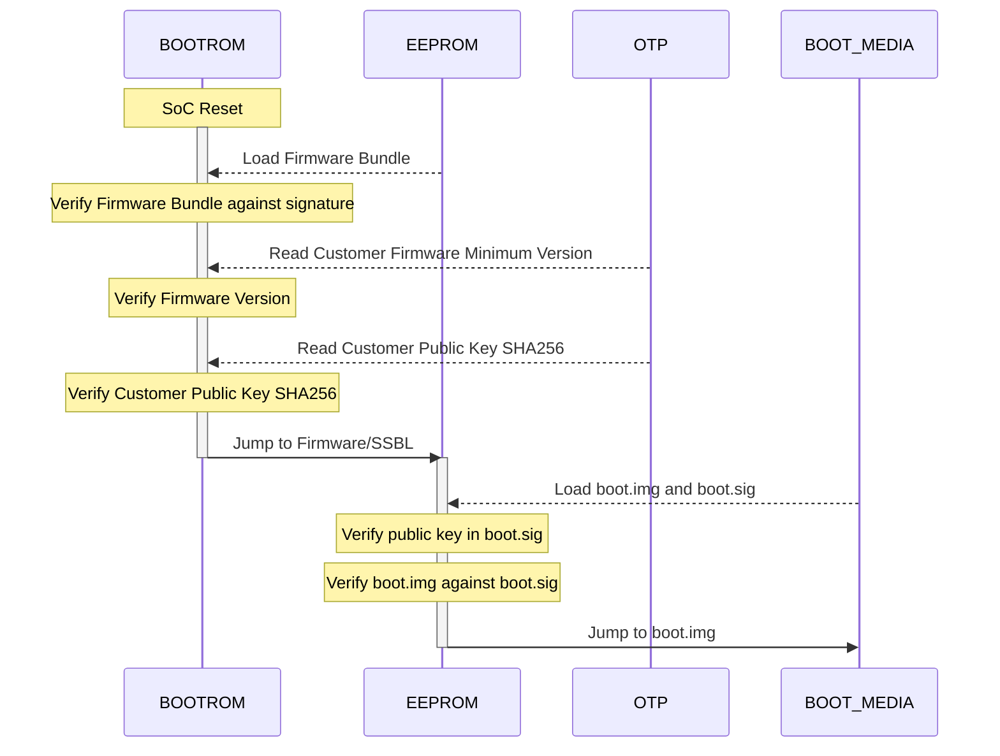

# nixos-rpi5-secure-boot

## Background

When deploying embedded systems, it is important to ensure that devices are only capable of running software approved by the maintainer of those systems (e.g., you!).  The initial phase of this is referred to as secure boot.  This process is usually tighly coupled to hardware, and builds a chain-of-trust from the device's boot ROM to the operating system.

On Raspberry Pi 5s, the rpi foundation provides a collection of scripts and low-level tools to provision a machine using secureboot.  The underlying technical details are sparse and spread around, but the process is seemingly described in [the usbboot tools repository](https://github.com/raspberrypi/usbboot/blob/master/docs/secure-boot.md), additionally including a [quickstart](https://github.com/raspberrypi/usbboot/tree/master/secure-boot-example).

## Objective

The goal of this project is to document the process used by the raspberry pi 5's secure boot, define a process to provision a new device for secure boot using NixOS, and deploying a provisioned device.  We should be able to demonstrate that running a "signed" SD card image will boot, while an unsigned SD card image will not.

### Chain of Trust on the Raspberry Pi 5

We'll start by working toward this chain of trust: https://github.com/raspberrypi/usbboot/blob/master/docs/secure-boot-chain-of-trust-2712.pdf

And this document: https://github.com/raspberrypi/usbboot/blob/master/docs/secure-boot.md

From those, lets derive the secure boot workflow, with an emphasis on identifying the secrets & how they are used.

#### Sequence Diagram

When the system comes out of reset, it begins executing the `BOOTROM` burned in to the SoC.  `BOOTROM` is responsible for loading the second stage bootloader from the on-board EEPROM (aka `bootsys`).

To facilitate this process, we need:

* An RSA2048 Keypair
    * Name: `Customer Key`
    * Purpose: Sign the `bootsys` sector & allow `BOOTROM` to validate the signature
    * Artifacts:
        * `private key` - used to sign `bootsys`.  Be sure to design secure processes for handling this.  We'll discuss these details later.
        * `public key` - bundled into `bootsys`
        * `public key sha256` - burned into OTP.  This ensures the hardware will only execute a `bootsys` signed by our public key.
    * The public key is bundled into `bootsys`
* A signed `bootsys`
    * Processes:
        * Sign with Customer Key
        * Write to EEPROM
* Firmware Version (TBD how to handle this)
* Signed Boot Media bundle

We'll keep these details in mind for later when we get to the provisioning step.

### Generating Signed Boot Media

Note that this section does not elaborate on the importance of securing your signing keys.  Be careful out there.

Referencing the [QSG](https://github.com/raspberrypi/usbboot/tree/master/secure-boot-example):

* Get `bootfiles.bin` from the [usbboot](https://github.com/raspberrypi/usbboot/blob/master/secure-boot-example/sign.sh) repo 
* Sign `bootfiles.bin` with the Customer Key using `rpi-sign-bootcode`.  See [the secure boot example](https://github.com/raspberrypi/usbboot/blob/master/secure-boot-example/sign.sh)
  * TODO: Inspect this signing util & extract the signing operation
* Sign the `boot.img`.  It will generate `boot.sig`.  Both files are bundled into the first partition of the boot drive

TODO: Cover the secure handoff from `boot.img` to an encrypted rootfs.

Lets break this down into discrete, testable steps:

#### Get/Sign `bootfiles.bin`

* Inputs
    * `bootfiles.bin` - TODO: Can I build this myself?
    * `rpi-sign-bootcode` script
    * `customer-private-key`
    * TODO: Firmware Version (it's an argument passed to `rpi-sign-bootcode`)
* Outputs
    * Signed `bootfiles.bin`

### Device Provisioning

