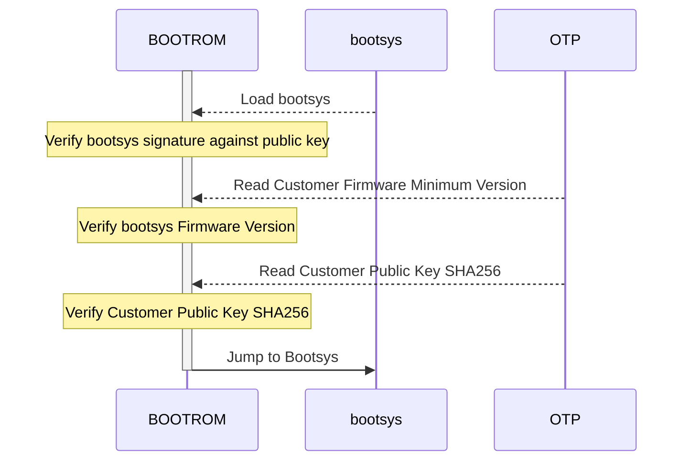

# nixos-rpi5-secure-boot

## Background

When deploying embedded systems, it is important to ensure that devices are only capable of running software approved by the maintainer of those systems (e.g., you!).  The initial phase of this is referred to as secure boot.  This process is usually tighly coupled to hardware, and builds a chain-of-trust from the device's boot ROM to the operating system.

On Raspberry Pi 5s, the rpi foundation provides a collection of scripts and low-level tools to provision a machine using secureboot.  The underlying technical details are sparse and spread around, but the process is seemingly described in [the usbboot tools repository](https://github.com/raspberrypi/usbboot/blob/master/docs/secure-boot.md), additionally including a [quickstart](https://github.com/raspberrypi/usbboot/tree/master/secure-boot-example).

## Objective

The goal of this project is to document the process used by the raspberry pi 5's secure boot, define a process to provision a new device for secure boot using NixOS, and deploying a provisioned device.  We should be able to demonstrate that running a "signed" SD card image will boot, while an unsigned SD card image will not.

### Secure Boot on the Raspberry Pi 5

We'll start by working toward this chain of trust: https://github.com/raspberrypi/usbboot/blob/master/docs/secure-boot-chain-of-trust-2712.pdf

And this document: https://github.com/raspberrypi/usbboot/blob/master/docs/secure-boot.md

From those, lets derrive the secure boot workflow, with an emphasis on identifying the secrets & how they are used

#### Boot ROM

